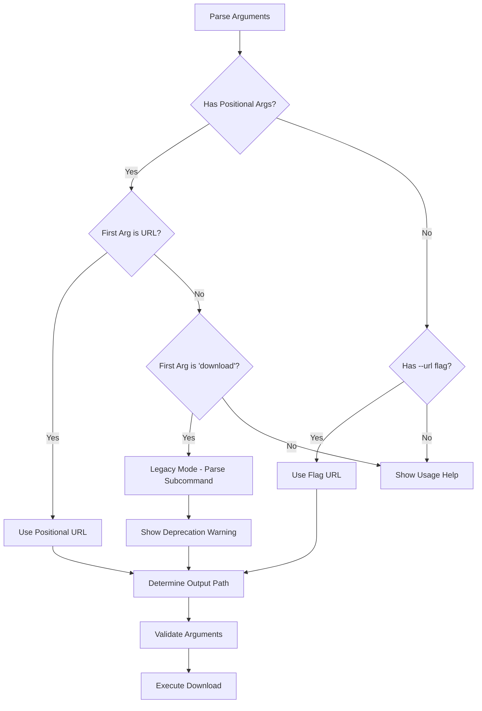

# CLI Improvement Design Document

## Overview

This design transforms the durable-resume CLI from a verbose, subcommand-based interface to a streamlined, intuitive tool that follows modern CLI conventions. The redesign eliminates unnecessary complexity while maintaining all existing functionality and adding backward compatibility.

## Architecture

### Current Architecture Issues
- Root command requires explicit "download" subcommand
- Verbose flag requirements for basic operations  
- Inconsistent flag naming conventions
- Poor argument validation and error messaging

### New Architecture
- Direct URL-based invocation as primary interface
- Intelligent argument parsing with positional URL support
- Consistent flag naming following Unix conventions
- Enhanced validation with helpful error messages
- Backward compatibility layer for existing scripts

## Components and Interfaces

### 1. Command Structure Redesign

**New Primary Interface:**
```bash
# Simple cases
durable-resume <URL>
durable-resume <URL> <output-path>

# With options
durable-resume <URL> -o <output-path> --segments 8
```

**Backward Compatible Interface:**
```bash
# Legacy support (with deprecation warning)
durable-resume download --url <URL> --out <directory>
```

### 2. Flag Redesign

**Current Flags → New Flags:**
- `--url` → Positional argument (primary) or `-u/--url` (alternative)
- `--out` → `-o/--output` (supports both directory and full file path)
- `--file` → `-n/--name` (filename only, used with directory output)
- `--segment-size` → `-s/--segment-size` (unchanged)
- `--segment-count` → `-c/--segments` (more intuitive name)

**New Flags:**
- `--no-segments` → Disable segmented downloading
- `--quiet/-q` → Suppress progress output
- `--verbose/-v` → Enhanced logging
- `--resume/-r` → Explicit resume mode (default behavior)

### 3. Argument Parsing Logic

```go
type CLIArgs struct {
    URL        string  // Positional arg or --url flag
    Output     string  // -o/--output (file path or directory)
    Name       string  // -n/--name (filename when output is directory)
    Segments   int     // -c/--segments
    SegmentSize int64  // -s/--segment-size
    NoSegments bool    // --no-segments
    Quiet      bool    // -q/--quiet
    Verbose    bool    // -v/--verbose
    Resume     bool    // -r/--resume (default true)
}
```

### 4. Command Resolution Flow



## Data Models

### Enhanced Options Structure

```go
type DownloadConfig struct {
    // Core settings
    URL         string
    OutputPath  string  // Full path to output file
    
    // Segmentation
    SegmentCount int
    SegmentSize  int64
    UseSegments  bool
    
    // Behavior
    Resume      bool
    Quiet       bool
    Verbose     bool
    
    // Derived fields
    Directory   string  // Extracted from OutputPath
    Filename    string  // Extracted from OutputPath or URL
}
```

### Path Resolution Logic

```go
func ResolveOutputPath(url, output, name string) (string, error) {
    // Priority:
    // 1. If output is a full file path, use it
    // 2. If output is directory + name provided, combine them
    // 3. If output is directory only, extract filename from URL
    // 4. If no output, use current directory + URL filename
}
```

## Error Handling

### Enhanced Error Messages

**Current:** `invalid remote url: parse "": empty url`
**New:** `Error: Invalid URL provided
  
  The URL "" is not valid. Please provide a complete URL including protocol.
  
  Examples:
    durable-resume https://example.com/file.zip
    durable-resume ftp://files.example.com/data.tar.gz`

### Validation Improvements

1. **URL Validation:** Check protocol, format, and accessibility
2. **Path Validation:** Verify write permissions and disk space
3. **Segment Validation:** Ensure reasonable values with suggestions
4. **Conflict Detection:** Handle conflicting flags gracefully

## Testing Strategy

### Unit Tests
- Argument parsing logic for all input combinations
- Path resolution with various input scenarios
- Flag validation and error message generation
- Backward compatibility mode detection

### Integration Tests
- End-to-end CLI invocation with different argument patterns
- Error handling for invalid inputs
- Backward compatibility with existing scripts
- Progress output formatting

### User Experience Tests
- Help text clarity and usefulness
- Error message actionability
- Common usage pattern efficiency
- Migration path from old to new syntax

## Implementation Phases

### Phase 1: Core Argument Parsing
- Implement new argument parsing logic
- Add positional URL support
- Create path resolution functions
- Maintain existing functionality

### Phase 2: Enhanced UX
- Improve error messages and validation
- Add new convenience flags
- Implement help text improvements
- Add usage examples

### Phase 3: Backward Compatibility
- Add legacy command detection
- Implement deprecation warnings
- Ensure existing scripts continue working
- Document migration path

### Phase 4: Advanced Features
- Add quiet/verbose modes
- Implement enhanced progress display
- Add configuration file support
- Performance optimizations

## Migration Strategy

### Deprecation Timeline
1. **Immediate:** New syntax available alongside old
2. **Warning Phase:** Show deprecation notices for old syntax
3. **Documentation:** Update all examples to new syntax
4. **Future:** Consider removing old syntax in major version bump

### User Communication
- Clear migration guide in documentation
- Helpful deprecation warnings with exact new syntax
- Examples showing before/after command patterns
- Gradual rollout to minimize disruption